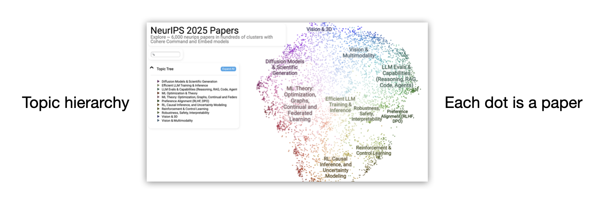
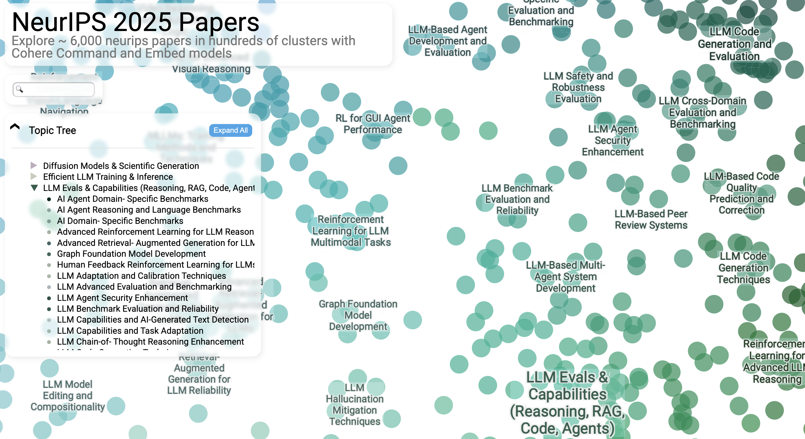
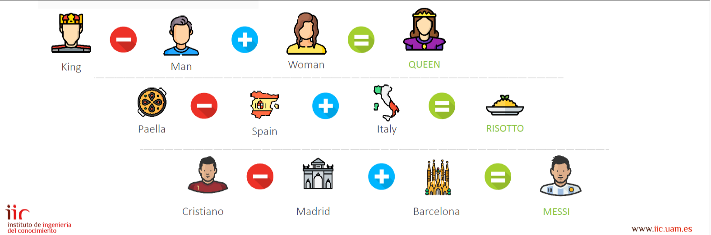

# LLMS (Large Language Models)
## EFI Data-Led Research Methods Training Programme
## Digital Method of the Month
Schedule: 
- 10:00-10:05 Housekeeping. 
- 10:05-10:10 Introductions from the presenters and attendees. 
- 10:10-10:25 An overview of LLMs.
- 10:25-10:50 Discussion using this document of what LLMs can and cannot do. 
- 10:50-11:00 Discuss available resources, way forwards and wrapping up. 

This resource was created by Chris Oldnall and updated/edited by Dr. Somya Iqbal in 2026.

## Introduction

Large Language Models (LLMs) are **not by nature, a research method**. They are computational models that can be incorporated into many different research workflows.

Depending on the task, researchers might use them to:

* summarise or classify text;
* generate or edit text;
* assist with coding;
* extract structured information from documents;
* explore patterns in collections of text;
* support qualitative or quantitative analysis;
* interact with other software tools through natural language.

Their usefulness does not remove the need for methodological choices, validation, documentation or critical interpretation. 

> **A useful rule of thumb:** treat an LLM as a tool whose output requires evaluation, rather than as an authority whose output can simply be accepted.

## NLP, Language Models, LLMs and Chatbots are not one and the same thing

These terms are often used interchangeably in public discussion, but they describe different things.

**Natural Language Processing (NLP)**
> The broad field concerned with computational approaches to human language. For example it includes: Translation, sentiment analysis, named-entity recognition.

**Language model**
> A model that learns statistical patterns in sequences of language. An example of what it includes-> Predicting a likely next token.

**Large Language Model (LLM)**
> A language model trained at large scale on substantial amounts of data and capable of being adapted to many tasks. These include, GPT-family models, Claude-family models, Gemini-family models, Llama.

**Foundation model**
> A broadly trained model that can be adapted for many different downstream tasks.

**Instruction-tuned model**
> A model that has undergone additional training so that it responds more usefully to instructions.

**Chatbot / assistant**
> An application or system through which a user interacts with one or more models, for example ChatGPT, Claude, Gemini.

Some of the most widely known (LLM-based) AI assistants and services include:

- ChatGPT (Generative Pre-trained Transformer) 
- Claude (Anthropic) 
- Gemini (Google) 
- LLaMa (Meta)
- DeepSeek

These applications use underlying language models and software components. The model families include GPT, Llama and so forth.

The distinction between the **model** and the **application** is particularly important. For example, **ChatGPT is an application or service**, rather than the technical name of a particular LLM. It uses underlying models together with other software components. Similarly, a chatbot can contain much more than an LLM. Chatbots can have access to web search, retrieved documents, system instruction, an interface, tools, and much more.

Modern LLMs emerged from decades of work in statistics, linguistics, neuroscience, machine learning and natural language processing. A particularly important milestone was the 2017 paper "Attention Is All You Need" by Vaswani and colleagues.

The paper introduced the Transformer architecture. Transformers made it possible to train language models efficiently while modelling relationships between different parts of a sequence using mechanisms known as attention. Most prominent contemporary LLM families are descended from transformer-based architectures.

The "T" in GPT stands for Transformer. GPT stands for Generative Pre-trained Transformer. ChatGPT is the name of an application built using models from this broader lineage.

* [Vaswani et al. — *Attention Is All You Need*](https://proceedings.neurips.cc/paper/7181-attention-is-all-you-need)
* [Jay Alammar — *The Illustrated Transformer*](https://jalammar.github.io/illustrated-transformer/)

## Research with LLMs has a wide span and interest




Explore the full visualisation here [NeurIPS papers] (https://jalammar.github.io/assets/neurips_2025.html)

For now, we’ll focus primarily on **instruction-following LLMs**: general-purpose models that have been adapted to respond to user instructions. These are often built from foundation models. 
    
## From autocomplete to conversation

One way into understanding an LLM is to begin with something we are well accustomed to: *autocomplete*.

Imagine typing:

- The capital of France is...

A language model estimates which continuation is likely to come next.Modern generative LLMs perform a much more sophisticated version of this process. Importantly, they generally predict the next token, rather than necessarily the next complete word.

A token might be: "cat", "ing", "2026", "," or some other frequently occurring piece of text. Generation therefore looks conceptually something like:

Prompt -> Tokenisation -> Tokens represented as numbers -> Transformer layers ->
Scores for possible next tokens -> Choose or sample a token ->Add it to the sequence -> Repeat.

Jay Alammar's The Illustrated GPT-2 provides an excellent visual explanation of this process. [The Illustrated GPT-2 (Visualizing Transformer Language Models](https://jalammar.github.io/illustrated-gpt2/)

## Step 1: Tokenisation

Computers do not process a sentence in quite the same form in which we read it.

A sentence such as:

```text
Large language models are interesting.
```

is first divided into **tokens**.

Conceptually, this might look something like:

```text
["Large", " language", " models", " are", " interesting", "."]
```

The exact divisions depend on the tokeniser being used. Each token is then mapped to a numerical identifier.

Tokens are important because LLMs do not directly manipulate words and sentences in the same way humans perceive them. They operate over these numerical representations.

## Step 2: Embeddings — Representing Language Numerically

A token ID by itself does not capture meaning. Models therefore learn numerical representations called **embeddings**.

An embedding is a vector: a list of numbers representing information the model has learned about a token.

Conceptually:

```text
"king"   -> [ 0.18, -0.42,  0.91, ...]
"queen"  -> [ 0.21, -0.39,  0.88, ...]
"banana" -> [-0.63,  0.14, -0.22, ...]
```

For example in this each case, each value could relate to a feature.



Real embeddings contain many more dimensions. Words or concepts that occur in related contexts can acquire representations that are geometrically related.

### Try It Yourself

The TensorFlow **Embedding Projector** lets you explore high-dimensional embeddings visually:

https://projector.tensorflow.org/

Try searching for different words and inspecting which other terms appear near them.

> Does being close in an embedding space necessarily mean that two words have the same meaning?

Similarity might reflect:

* topic;
* usage;
* grammatical role;
* association;
* or other statistical patterns learned from data.

For an accessible visual explanation, see:

* [Jay Alammar — *The Illustrated Word2Vec*](https://jalammar.github.io/illustrated-word2vec/).

> Note: The Embedding Projector is useful for understanding the basic idea of vector representations. Modern LLMs go further by creating representations that change depending on the surrounding context.


## Context Changes Meaning

Think of the following:

> **Dallas** is a city in Texas.

and:

> **Dallas** called me yesterday.

The string `Dallas` appears in both sentences, but its role and likely meaning are very different.

Older approaches such as classic Word2Vec typically assign a word a relatively fixed representation. Transformers instead build **contextual representations**. As information moves through the network, the representation associated with a token is altered by its surrounding context.

That contextualisation is one of the important things attention mechanisms help achieve.

## Step 3: Attention

What is attention in a computational context? A useful intuition is:

> When processing a token, which other tokens in the available context should contribute most strongly to its representation?

For instance:

> The researcher put the paper on the table because **it** was wet.

What does `it` refer to?

Now look at:

> The researcher put the paper on the table because **it** had just been printed.

Humans use context to resolve relationships like these. Transformer attention gives the model a mechanism for constructing representations based on relationships between tokens in context.

Jay Alammar's [*The Illustrated Transformer*](https://jalammar.github.io/illustrated-transformer/) is one of the clearest visual introductions to this mechanism.

## Queries, Keys and Values

You will often see attention described using three terms:

* **Query**
* **Key**
* **Value**

The model compares queries and keys to calculate attention scores. Those scores determine how strongly different value representations contribute to the resulting representation.

This is more precise than describing attention simply as **"searching for similar things."** Similarity is involved mathematically, but attention is learned, contextual and task-dependent.

## Step 4: What Does Softmax Do?

The word **softmax** appears in several places in machine learning. Softmax converts a set of numerical scores into positive values that sum to one. 
Within an attention mechanism, softmax helps transform attention scores into normalised **attention weights**.

Near the output of a language model, a related operation can transform model scores into a probability distribution over possible next tokens.

> Softmax is not a measure of similarity. It is a mathematical function used to normalise scores.

## Step 5: Layers and Scale

A transformer does not perform the process  above just once. Modern LLMs contain many layers. During training, the model adjusts very large numbers of numerical parameters so that its predictions become better according to its training objective. There can be numerous neural networks in the layers, as well as embeddings, attention layers, tokens, and output represnetations.

The word **large** in Large Language Model can refer to several kinds of scale:

* number of model parameters;
* amount and diversity of training data;
* computational resources used for training;
* scale of the architecture.

# Step 6: Predicting the Next Token

After processing the context, a generative language model produces scores for possible next tokens.

A decoding strategy then selects or samples a token. That token is appended:

> Paris is the capital of **France**

The process starts again to produce the next token.

This repeated prediction process can eventually produce:

* paragraphs;
* conversations;
* summaries;
* translations;
* computer code;
* structured data;
* and many other forms of text.

## So Why Does Autocomplete look intelligent?

"Predicting the next token" can sound basic.

But successful next-token prediction across extremely large and diverse collections of language requires learning many patterns.

Those can include patterns relating to:

* grammar;
* writing style;
* factual associations;
* programming languages;
* document structure;
* argumentation;
* translation;
* common reasoning procedures;
* relationships between concepts.

This helps explain why sufficiently capable language models can be prompted to perform tasks that were not explicitly programmed as separate functions.

The GPT-3 paper was an important demonstration that increasing scale could produce substantial **few-shot** and **in-context** task performance.

See:

* [Brown et al. — *Language Models are Few-Shot Learners*](https://arxiv.org/abs/2005.14165)

However:

> **Generating plausible continuations is not the same thing as retrieving guaranteed facts.**

 For the above steps, take a look at the following video from Luis Serrano: [watch here](https://youtu.be/fkO9T027an0?si=ruBpC73ffxhV9gLy)

## From Language Model to Instruction-Following Assistant 

A model trained primarily to predict text is not automatically a good conversational assistant. For example: 

User: Explain photosynthesis simply. 

A raw language model might continue the text in unexpected ways rather than reliably treating it as an instruction. Modern assistants therefore generally undergo additional **post-training**. One influential approach was demonstrated through **InstructGPT**, which used human demonstrations and human preference data to improve instruction-following behaviour. Conceptually: 


- Pre-training 
"learn patterns in very large amounts of data" 
- Base model 
- Post-training / instruction tuning 
"learn how people want the model to respond" 
- Instruction-following model 
- Application / chatbot / agent

See: [Ouyang et al. Training Language Models to Follow Instructions with Human Feedback](https://arxiv.org/abs/2203.02155).

 This is why **foundation model** and **instruction-following model** should not be treated as synonyms. A foundation model refers primarily to the broad, reusable nature of a model and its training. Instruction-following describes behaviour introduced or strengthened through later adaptation and post-training. 


## The Context Window

LLMs do not have unlimited access to everything ever said to them. During a particular model invocation they operate over a finite **context window**, usually measured in tokens.

The context might include:
system instructions + conversation history + your current prompt +
documents supplied to the model + retrieved search results + tool outputs.

Different systems manage that context differently. This also means that apparent **memory** in a chatbot should not automatically be assumed to reside inside the LLM itself. An application may store information externally and insert relevant information into a later context.


## What Can LLMs Do?

Depending on the model and surrounding system, LLMs can be useful for tasks including:

* generating coherent and contextually relevant text;
* summarising documents;
* drafting and editing;
* brainstorming;
* text classification;
* information extraction;
* translation;
* writing and explaining code;
* converting between formats;
* assisting with qualitative coding;
* querying data through natural-language interfaces;
* semantic search and retrieval;
* identifying patterns for further investigation.

These capabilities can make them powerful research tools.

## What Can LLMs Not Guarantee?

LLMs cannot inherently guarantee:

* factual correctness;
* complete or representative coverage of the literature;
* accurate citations;
* freedom from bias;
* reproducible output unless the workflow is controlled;
* correct interpretation of ambiguous evidence;
* that fluent explanations reflect genuine evidence rather than plausible generation.

> Performance depends partly on the quantity, quality and representation of a language or domain in training and post-training data, and performance can vary substantially across languages.

The folllowing report is a good resource for understanding more; [On the Opportunities and Risks of Foundation Models](https://crfm.stanford.edu/report).

## Tool not Oracle
Arvind Narayanan and Sayash Kapoor's work provides a particularly useful perspective here. Their broader argument encourages us to analyse AI as technology embedded within human institutions and workflows rather than treating AI systems as autonomous sources of intelligence or authority.

Useful starting points include:

* [Arvind Narayanan and Sayash Kapoor — *AI as Normal Technology*](https://knightcolumbia.org/content/ai-as-normal-technology)

For research, this suggests asking:

1. What exact task is the model performing?
2. How will its output be validated?
3. What data is being sent to the model?
4. Could errors systematically affect the findings?
5. Can the process be documented or reproduced?
6. Where does human judgement enter the workflow?

## Three Things to Remember 

### 1. An LLM is a model, not a chatbot. 
>  A chatbot is an application that may contain an LLM together with many other components. 

### 2. An LLM generates language rather than retrieving guaranteed facts. 
> Even when an answer sounds authoritative, important claims require verification. 

 ### 3. Using an LLM does not remove research methodology. 
> Researchers still need to define tasks, evaluate validity, understand limitations and document decisions. 
---
## The way forward/training resources

### Foundational learning:
1. [Attention Is All You Need](https://proceedings.neurips.cc/paper_files/paper/2017/file/3f5ee243547dee91fbd053c1c4a845aa-Paper.pdf)
2. [Daniel Jurafsky: An Introduction to Natural Language Processing,
Computational Linguistics, and Speech Recognition
with Language Models](https://web.stanford.edu/~jurafsky/slp3/ed3book_aug26.pdf)

## Courses & tools

3. [Edinburgh Language Model (ELM)](https://elm.edina.ac.uk/elm/elm)
4. [Further training at EFI](https://efi.ed.ac.uk/research/data-led-research-methods-training-programme/)
5. [FreeCodeCamp YouTube LLM Tutorial (For those willing to test their Python skills)](https://www.youtube.com/watch?v=UU1WVnMk4E8) 

## Books
6. [Jay Alamer: Hands on LLMs](https://www.llm-book.com/)
